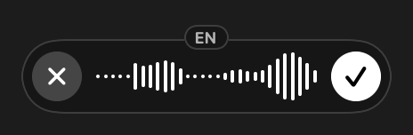
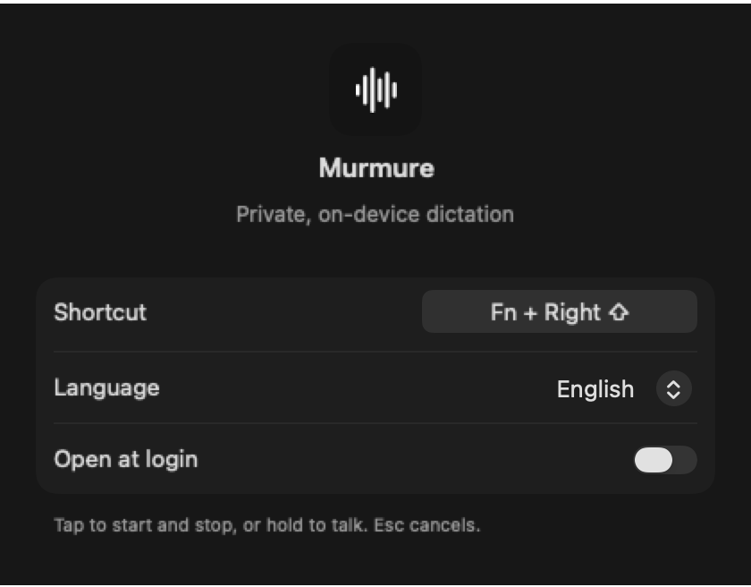

# Murmure

Private, on-device dictation for macOS. Press **Fn + Right ⇧**, speak, and the
text is pasted into the app you are using. Audio never leaves your Mac.

<p align="center">
  <br><br>
  
</p>

- **Tap** the shortcut to start, tap again to transcribe and paste. **Hold** it to push-to-talk.
- **Return** confirms, **Esc** cancels. Shortcut and language are set in Settings.

## Model

[Cohere Transcribe](https://huggingface.co/CohereLabs/cohere-transcribe-03-2026)
(about 2B parameters, 14 languages), in its
[MLX 2/3/4-bit build](https://huggingface.co/MarkChen1214/cohere-transcribe-03-2026-MLX-Mixed-2bit3bit4bit)
running on the Apple Silicon GPU: about 800 MB on disk and 1 GB in memory. A
small local service (`voiced`) loads it only once, keeps it shared with
[Orb](https://github.com/Th0rgal/sandboxed.sh), and unloads it after 10 minutes
of inactivity.

## Build and install

Requires Apple Silicon, macOS 14+, Xcode 16 and Python 3.10–3.13.

```sh
git clone https://github.com/Th0rgal/murmure && cd murmure
scripts/install-voiced.sh --download-model   # transcription service + model
scripts/build-app.sh --install               # build, sign, copy to /Applications
```

On first launch, grant **Accessibility** and **Microphone**. If Fn opens the
emoji picker, set *Keyboard › Press 🌐 key to* to *Do Nothing*.
